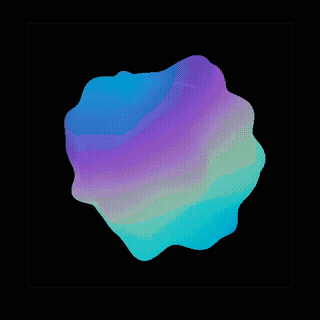

<div align="center">

# Jarvis Orb

### 생각하는 걸, 보세요.

*기억하는 두뇌. 숨쉬는 오브.*

<br>



<br><br>

[](https://github.com/thestack-ai/jarvis-orb/stargazers)
[](https://github.com/thestack-ai/jarvis-orb/releases)
[](LICENSE)
[](https://github.com/thestack-ai/jarvis-orb/releases)

[English](README.md) | **한국어**

</div>

---

매 세션마다 AI는 처음부터 시작합니다. 결정도, 선호도, 프로젝트 맥락도 — 전부 사라집니다.

**Jarvis Orb**는 AI에게 영구적인 두뇌를 심어주고, 그 사고 과정을 데스크탑 위의 살아있는 오브로 보여줍니다.

- **Brain Lite** — 4계층 메모리, 엔티티 추적, 모순 감지, 시간 가중 검색
- **Orb** — 항상 떠있는 플로팅 시각화. 두뇌 이벤트에 실시간 반응
- **MCP** — Claude Code, Cursor 등 MCP 호환 도구와 연동

## 설치

**macOS / Linux:**
```bash
curl -fsSL https://raw.githubusercontent.com/thestack-ai/jarvis-orb/main/install.sh | bash
```

**Windows (PowerShell):**
```powershell
irm https://raw.githubusercontent.com/thestack-ai/jarvis-orb/main/install.ps1 | iex
```

**직접 다운로드** → [최신 릴리스](https://github.com/thestack-ai/jarvis-orb/releases/latest)

설치하면 끝. Brain이 시작되고, Orb가 뜨고, Claude Code가 연결됩니다.

## 작동 원리

```
┌──────────────┐     MCP      ┌──────────────┐    WebSocket    ┌──────────┐
│  Claude Code │ ──────────── │  Brain Lite   │ ──────────────  │   Orb    │
│  / Cursor    │   도구 호출  │  (Python)     │    이벤트       │ (Tauri)  │
│              │              │               │                 │          │
│  일합니다.   │              │  기억합니다.  │                 │ 보입니다.│
└──────────────┘              └──────────────┘                  └──────────┘
                                    │
                              ~/.jarvis-orb/
                               brain.db (SQLite)
```

평소처럼 Claude Code에서 작업하면 됩니다. Brain Lite가 MCP 서버로 돌면서 기억을 저장하고, 엔티티를 추적하고, 모순을 감지합니다. Orb는 화면에 떠있으면서 모든 두뇌 이벤트에 실시간으로 반응합니다.

## Brain Lite

| 기능 | 설명 |
|------|------|
| **4계층 메모리** | 에피소드, 시맨틱, 프로젝트, 절차 — 자동 분류 |
| **시간 가중 스코어링** | 최근 기억이 높은 순위 (30일 반감기) |
| **관찰 메타데이터** | 모든 기억에 상태 태그: 검증됨, 오래됨, 모순됨 |
| **모순 감지** | 충돌하는 기억은 검색 결과에서 자동 제외 |
| **엔티티 추적** | 프로젝트, PR, 결정을 상태 이력이 있는 객체로 추적 |
| **관계형 저장** | 사람 → 프로젝트 → 결정을 경량 Knowledge Graph로 연결 |
| **FTS5 검색** | 전체 메모리 전문 검색 |

### MCP 도구

```
memory_save      기억 저장 (4계층 자동 분류)
memory_search    시간 가중 + 모순 필터링 검색
memory_verify    기억을 검증됨/대체됨/모순됨으로 표시
entity_create    프로젝트, 사람, 결정, 도구를 추적
entity_update    엔티티 상태 변경 (변경 이력 기록)
entity_query     타입이나 이름으로 엔티티 조회
entity_relate    엔티티 간 관계 생성
```

## 오브 반응

오브는 장식이 아닙니다. 두뇌가 무엇을 하는지 보여줍니다.

| 두뇌 이벤트 | 오브 반응 |
|------------|----------|
| 기억 저장 | 파티클이 오브로 흡수 |
| 모순 감지 | 빨간/오렌지 펄스 |
| 엔티티 상태 변경 | 시안 플래시 + 스케일 펄스 |
| 검색 실행 | 바이올렛 색 전환 |
| 컨텍스트 압축 | 수축 후 팽창 |
| 세션 시작 | 기상 글로우 |

## 기술 스택

| 레이어 | 기술 | 이유 |
|--------|------|------|
| Brain | Python, aiosqlite, FTS5 | 검증됨, 설정 불필요, 단일 파일 DB |
| MCP | FastMCP (stdio) | Claude Code / Cursor 네이티브 |
| Orb | Tauri 2, Three.js, WebGL | 3MB (150MB 아님). 커스텀 셰이더. |
| 연결 | WebSocket | 실시간, 양방향 |
| 빌드 | GitHub Actions | 태그마다 macOS + Windows 자동 빌드 |

## 철학

실제 시스템에서 만들어졌습니다. 제작자의 개인 AI 컨트롤 플레인 — Jarvis — 은 19개 모듈, 100개 이상의 엔티티와 500개 이상의 기억을 가진 Knowledge Graph, 22개 에이전트 팀으로 운영됩니다. Jarvis Orb는 그 두뇌의 경량 오픈소스 버전입니다.

AI는 당신을 기억하고, 맥락을 이해하고, 생각하는 모습을 보여줘야 합니다. 매 세션마다 처음부터 시작하는 게 아니라.

## 기여

PR 환영합니다. [CONTRIBUTING.md](CONTRIBUTING.md)를 참고하세요.

```bash
# 개발 환경
git clone https://github.com/thestack-ai/jarvis-orb.git
cd jarvis-orb

# Brain
cd brain && uv venv .venv && source .venv/bin/activate
uv pip install aiosqlite websockets mcp pytest pytest-asyncio
python -m pytest tests/ -v

# Orb
cd ../orb && pnpm install && pnpm tauri dev
```

## 라이선스

MIT

---

<div align="center">

**도구가 아닙니다. 존재입니다.**

*결정을 기억합니다. 세계를 추적합니다. 데스크탑 위에서, 살아 숨쉽니다.*

<br>

[설치](https://github.com/thestack-ai/jarvis-orb/releases/latest) · [랜딩 페이지](https://jarvis-orb.vercel.app) · [버그 리포트](https://github.com/thestack-ai/jarvis-orb/issues)

</div>
